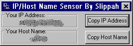



## IP/Host Name Sensor

### Description

This code is a simple program designed to "sniff" or sense your own IP address and host name

and return it to you in a label. This program is so simple, the grunt of the

application is only 2 lines of code! But after I added a few extra features, the

code became 13 lines. This program allows you to copy your IP address and host name to the

clipboard (whoopdy doo) and it tells you your IP and host name, but other than that it does

nothing.

Note: In order for this code to work, you will need Microsoft Winsock 6.0 (an OCX)

Note: On the screen shot there is a blotched out part. I blotched this out

using a paint program, because the screen shot would display my IP address and host name.

This will not occur on your computer.
 
### More Info
 

             |
---                |---
**Submitted On**   |2001-07-09 14:36:12
**By**             |[Slippah](https://github.com/Planet-Source-Code/PSCIndex/blob/master/ByAuthor/slippah.md)
**Level**          |Beginner
**User Rating**    |4.3 (13 globes from 3 users)
**Compatibility**  |VB 6\.0
**Category**       |[Internet/ HTML](https://github.com/Planet-Source-Code/PSCIndex/blob/master/ByCategory/internet-html__1-34.md)
**World**          |[Visual Basic](https://github.com/Planet-Source-Code/PSCIndex/blob/master/ByWorld/visual-basic.md)
**Archive File**   |[IP\_Host Na22468792001\.zip](https://github.com/Planet-Source-Code/slippah-ip-host-name-sensor__1-24847/archive/master.zip)

